# DevOps 실습

> String Boot 기반의 심플한 Web application을 Jenkins pipeline을 이용하여 Kubernetes에 디플로이   
> 실습환경은 IBM Cloud의 Kubernetes Cluster 를 사용합니다.   
> Jenkins는 Kubernetes 환경에 사전 설치되어 있는 형태로 Pipeline 작성 위주로 실습합니다.   

## 참조 링크
* Kubernetes에 Jenkins 설치   
  https://developer.ibm.com/tutorials/configure-a-cicd-pipeline-with-jenkins-on-kubernetes/
* Jenkins 설정 (Kubernetes plugin)   
  https://www.oracle.com/webfolder/technetwork/tutorials/obe/oci/configure_jenkins_kubernetes_plugin/configurekubernetesplugin.html
## Github 프로젝트 가져오기
실습을 위해서 대상 애플리케이션을 각 개인 계정의 github로 fork 합니다. 
실습 대상 애플리케이션은 Spring Boot sample 중 하나 입니다.

다음의 링크로 접속하여 아래 화면과 같이 `fork`를 합니다.

https://github.com/spring-guides/gs-serving-web-content

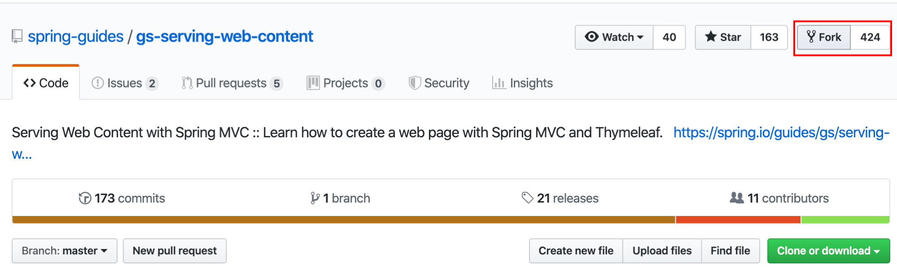
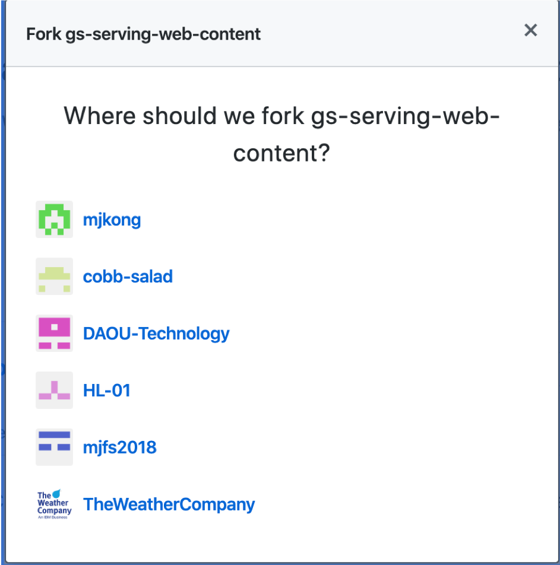

`fork`가 완료되었으면 `github`링크 주소를 저장해 둡니다. 향후 `Jenkins` 설정 시 사용하게 됩니다.

## Jenkins 계정 만들기 
실습을 위해서 Jenkins에 접속하여 각자 계정을 생성합니다. 각 자 `admin` 계정으로 로그인 한 뒤 `Left panel --> Manage Jenkins --> Manage Users 클릭 --> Left panel의 Create user 클릭` 

Jenkins link: http://173.193.112.66:30100

> 참고로 어드민 계정 정보는 다음과 같습니다.   

~~~
ID : admin
PW : passw0rd
~~~

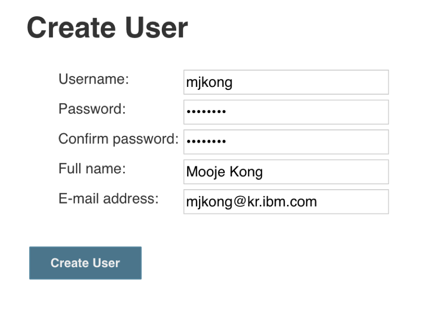

완료 후 생성한 계정으로 재접속 합니다.

## Credentials 추가
Jenkins에 접속하였으면 Pipeline 에서 사용할 `Credentials` 정보를 입력합니다.

아래 그림과 같이 Jenkins root 페이지의 Left panel에서 `Credentials` 를 선택하고 메인화면의 Jenkins 항목의 global에서 `Add credentials`를 선택합니다.

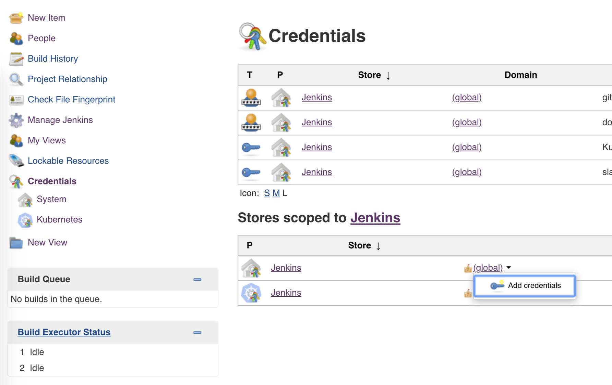

## Pipeline 만들기

1. Pipiline 생성
Jenkins root 페이지에서 아래 그림과 같이 `New Item`을 선택하여 새로운 Pipeline을 생성합니다.

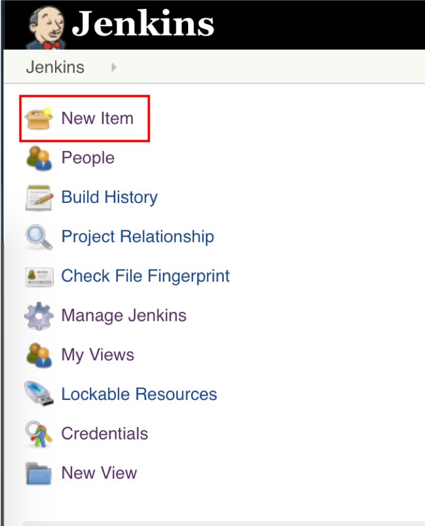
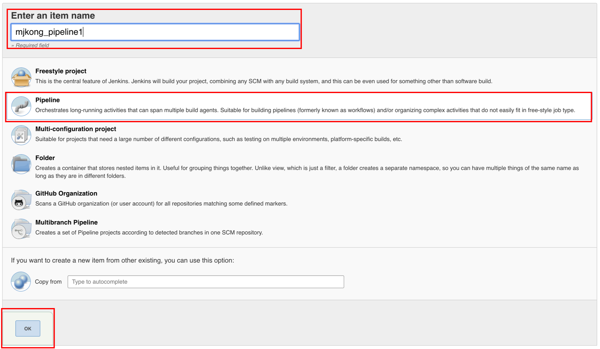

## Pipeline 설정
앞서 Pipeline 생성을 완료하였으면 몇 가지 설정을 합니다. 

1. Github project   
Pipeline 설정 창의 `General` 탭에서 `GitHub project`를 체크하고 앞서 `Fork`한 git url을 입력합니다.   
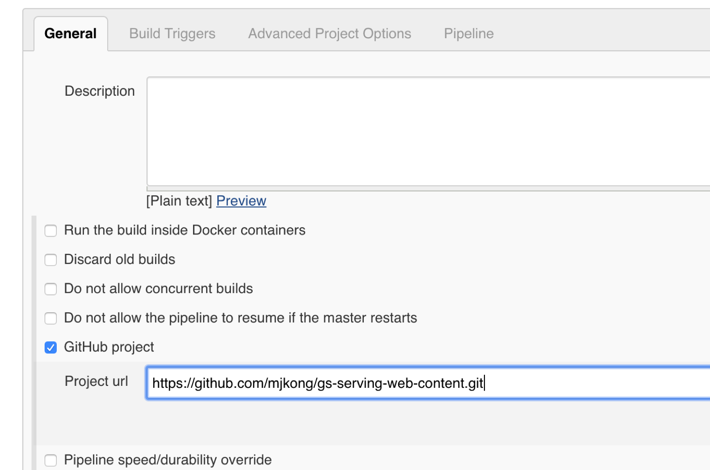

1. Build triggering 옵션   
앞서 설정한 Git에 소스 변경이 일어났을 때 자동으로 Pipeline Triggering하기 위한 설정입니다.   
`Build Triggers` 탭에서 `GitHub hook trigger for GITScm polling` 항목을 체크합니다.  
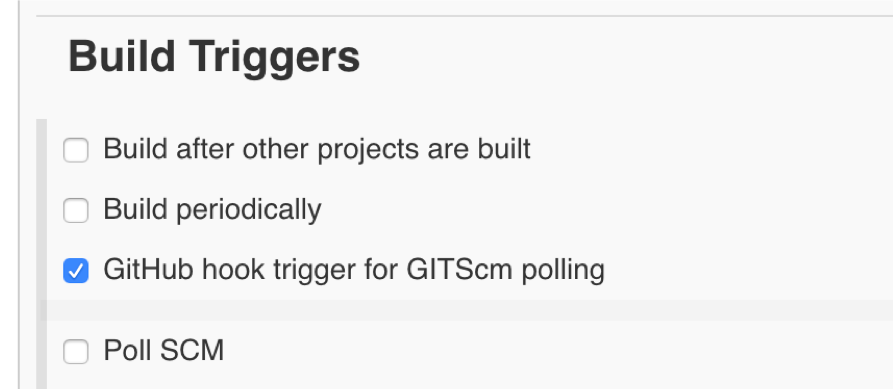   

1. Pipeline   
마지막 설정으로 Pipeline 정의를 위한 설정을 합니다.    

| 항목 | 값 |
|---|---:|
| `Definition` | Pipeline scripts from SCM |
| `SCM` | Git |
| `Repositories` | 개별 Fork 한 git url |
| `Credential` | 개별 추가한 Credential |

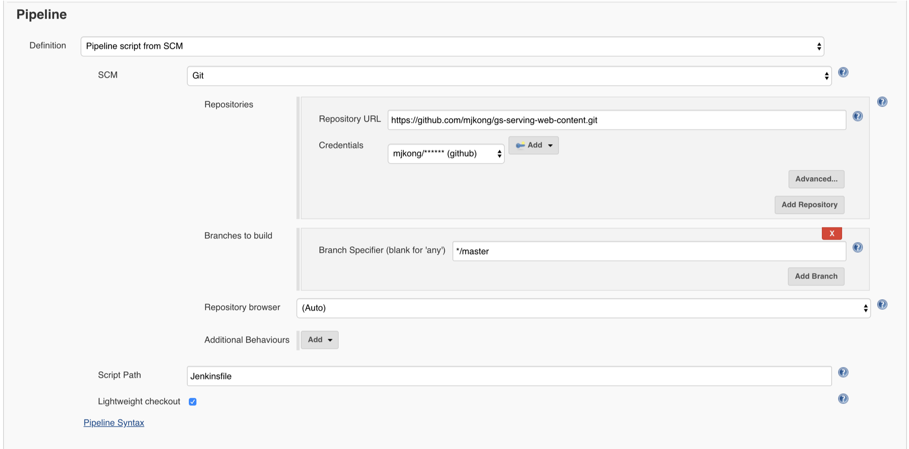

설정을 완료하였으면 `Save` 버튼을 클릭하여 저장합니다.

## Github webhook 설정
Pipeline이 생성되었으면 git 소스 변경시 Pipeline을 Trigger 하기 위해서 webhook 설정을 합니다.

Github 프로젝트 화면에서 `Settings --> Webhooks`를 클릭합니다.
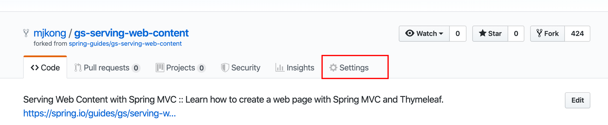

그리고 `Add webhook` 버튼을 클릭하고 다음의 링크를 입력합니다.   
http://173.193.112.66:30100/github-webhook/   

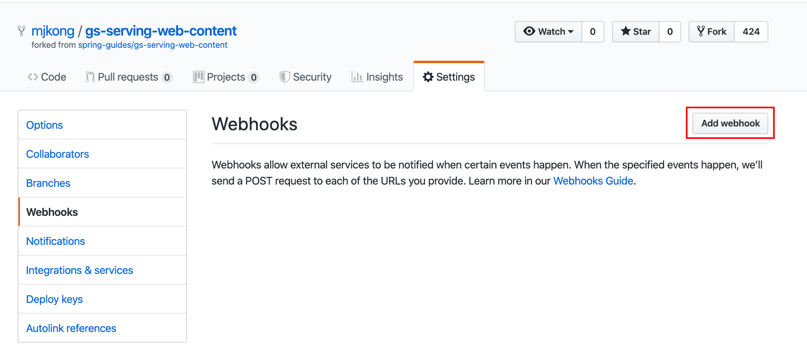

링크 입력 후 `Add webhook`을 클릭하여 설정을 완료합니다.   

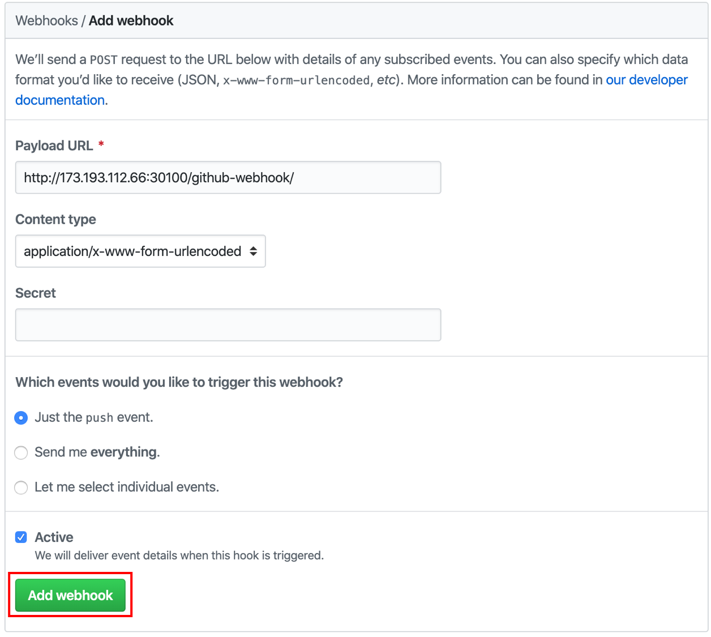

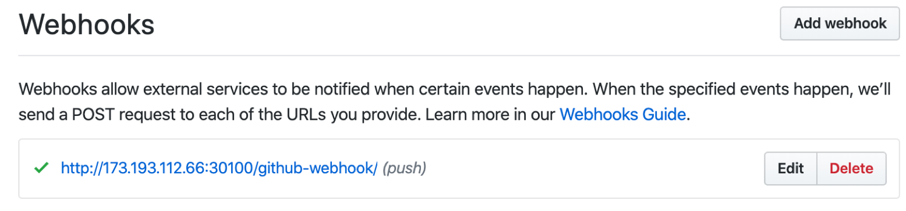

## Pipeline 개발   
설정이 완료되었으면 Pipeline을 개발을 시작해 봅니다.   
개발 PC에서 git clone 한 뒤 Pipeline을 정의할 `Jenkinsfile`을 추가하고 push 합니다.

~~~shell
cd 프로젝트 저장 위치
git clone https://github.com/mjkong/gs-serving-web-content.git
cd gs-serving-web-content
vi Jenkinsfile
~~~

`Jenkinsfile`에는 다음의 내용을 입력합니다.

~~~groovy
def label = "worker-${UUID.randomUUID().toString()}"

podTemplate(label: label, containers: [
  containerTemplate(name: 'gradle', image: 'gradle:4.5.1-jdk8', command: 'cat', ttyEnabled: true),
  containerTemplate(name: 'docker', image: 'docker:dind', command: 'dockerd --host=unix:///var/run/docker.sock --host=tcp://0.0.0.0:2375 --storage-driver=overlay', ttyEnabled: true, alwaysPullImage: true, privileged: true),
  containerTemplate(name: 'kubectl', image: 'lachlanevenson/k8s-kubectl:v1.8.8', command: 'cat', ttyEnabled: true)
]) {
  node(label) {
    stage('Build') {
      try {
        container('gradle') {
            sh "echo Build"
        }
      }
      catch (exc) {
        println "Failed to test - ${currentBuild.fullDisplayName}"
        throw(exc)
      }
    }
    stage('Dockerizing') {
      try{
        container('docker') {
            sh "echo Dockerizing"
        }
      }
      catch (exc) {
        println "Failed to build - ${currentBuild.fullDisplayName}"
        throw(exc)
      }
    }
    stage('Deploy') {
      container('kubectl') {
          sh "echo Deploy"
      }
    }
  }
}
~~~

~~~
def label = "worker-${UUID.randomUUID().toString()}"

podTemplate(label: label, containers: [
  containerTemplate(name: 'gradle', image: 'gradle:4.5.1-jdk8', command: 'cat', ttyEnabled: true),
  containerTemplate(name: 'docker', image: 'docker:dind', command: 'dockerd --host=unix:///var/run/docker.sock --host=tcp://0.0.0.0:2375 --storage-driver=overlay', ttyEnabled: true, alwaysPullImage: true, privileged: true),
  containerTemplate(name: 'kubectl', image: 'lachlanevenson/k8s-kubectl:v1.8.8', command: 'cat', ttyEnabled: true)
//  containerTemplate(name: 'helm', image: 'lachlanevenson/k8s-helm:latest', command: 'cat', ttyEnabled: true)
]) {
//volumes: [
	//hostPathVolume(mountPath: '/var/run', hostPath: '/run'),
	//hostPathVolume(mountPath: '/var/lib/docker', hostPath: '/var/run/docker')
//]) {
  node(label) {
		def myRepo = checkout scm
    def gitCommit = myRepo.GIT_COMMIT
    def gitBranch = myRepo.GIT_BRANCH
    def shortGitCommit = "${gitCommit[0..10]}"
    def previousGitCommit = sh(script: "git rev-parse ${gitCommit}~", returnStdout: true)

    stage('Build') {
      try {
        container('gradle') {
					sh "pwd"
					sh "gradle -b complete/build.gradle build"
          //sh "sudo echo 'GIT_BRANCH=${gitBranch}' >> /etc/environment"
          //sh "sudo echo 'GIT_COMMIT=${gitCommit}' >> /etc/environment"
        }
      }
      catch (exc) {
        println "Failed to test - ${currentBuild.fullDisplayName}"
        throw(exc)
      }
		}
		stage('Dockerizing') {
			try{
				container('docker') {
					withCredentials([[$class: 'UsernamePasswordMultiBinding',
					  credentialsId: 'dockerhub',
					  usernameVariable: 'DOCKER_HUB_USER',
					  passwordVariable: 'DOCKER_HUB_PASSWORD']]) {
					  sh """
					    docker login -u ${DOCKER_HUB_USER} -p ${DOCKER_HUB_PASSWORD}
					    docker build -t mjkong/web-sample .
					    docker push mjkong/web-sample
				    """
					}
				}
      }
			catch (exc) {
				println "Failed to build - ${currentBuild.fullDisplayName}"
				throw(exc)
			}
		}
		stage('Run kubectl') {
      container('kubectl') {
        sh """
					kubectl apply -f ./k8s/service.yaml --validate=false
					kubectl apply -f ./k8s/deployment.yaml --validate=false
				"""
      }
    }
  }
}
~~~
